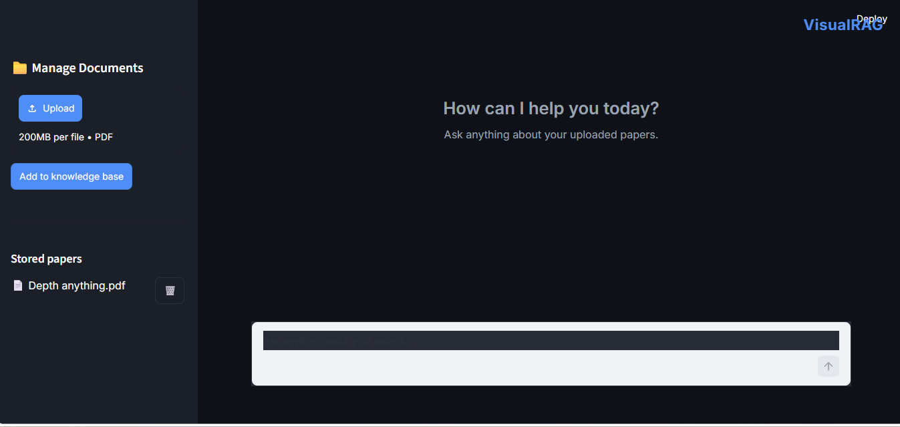
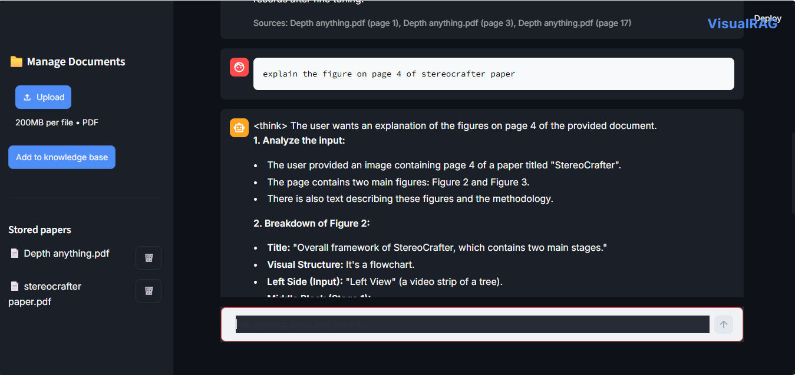
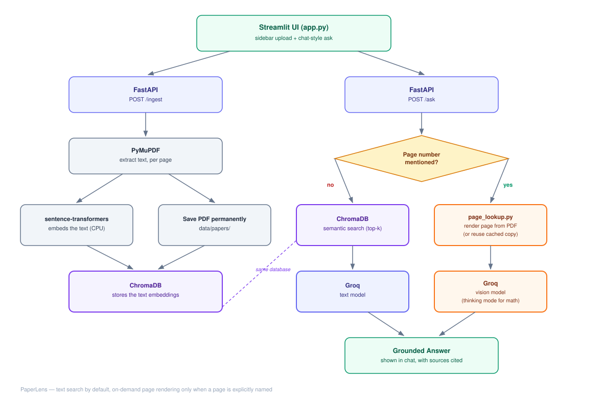

# VisualRAG

**A multimodal Research Paper Companion.** Upload your papers, ask questions in plain language, and get answers grounded in what's actually in them - including the parts most "chat with your PDF" tools quietly ignore: figures, tables, and equations.

---

## Why this exists

Most tools that let you "chat with a PDF" only ever read the extracted text layer. That works fine for prose, but it means anything that actually lives in a diagram, a chart, or an equation gets silently dropped before the model ever sees it - you end up asking about a figure and getting an answer synthesized from its caption, not from the figure itself.

This project was built to fix that specific gap, and it went through a real redesign to get there. The first version tried to make *every* page semantically searchable by image, embedding every rendered page through CLIP alongside the text. It worked, but it was solving a problem nobody actually has that often — in practice, people ask about figures by naming them directly ("explain the diagram on page 4"), not by vague visual similarity. So the project was rebuilt around that reality: plain text search for general questions, and a page's image is only ever rendered - on demand, then cached - the moment a question actually references it. Cheaper, faster, and closer to how the tool is actually used.

---

## Demo

<!-- Capture these after your next run and drop them in assets/screenshots/ -->



A short screen recording (upload a paper → ask a page-specific question → get a grounded answer with sources) converted to a GIF is worth more here than any amount of written description — worth doing before this goes on a resume.

---

## Architecture



Two independent paths share one knowledge base:

- **No specific page mentioned** → the question is embedded and matched against stored text chunks (semantic search), and Groq's text model answers from the closest matches.
- **A specific page is named** ("page 4", "the figure on page 12") → that exact page is rendered from the original PDF (or pulled from cache if it's been asked about before) and sent, image and all, to a vision-capable Groq model — with its "thinking mode" turned on specifically for math and structural reasoning.

---

## How It Works

1. **Ingest** — every PDF page's text is extracted and embedded (`sentence-transformers`, running locally on CPU) and stored in ChromaDB. The original PDF itself is kept permanently on disk — deliberately, so a page can still be rendered on demand later, even long after upload.
2. **Ask** — the question is checked for an explicit page/paper reference first. If found, that page gets rendered (or reused from cache) and reasoned over visually. If not, it falls back to semantic search over the stored text.
3. **Manage** — uploaded papers can be listed and deleted at any time; deleting a paper cleans up its text entries, any cached page renders, and the original file together, not just one of the three.
4. **Interface** — a Streamlit front end (`app.py`) talks to a FastAPI backend (`api.py`) over plain HTTP — two separate processes, the same way a real product's frontend and backend are typically split.

---

## Tech Stack

| Layer | Tool |
|---|---|
| Embeddings | `sentence-transformers` (all-MiniLM-L6-v2) |
| Vector database | ChromaDB |
| Generation | Groq API (text + vision models) |
| Backend | FastAPI |
| Frontend | Streamlit |
| PDF processing | PyMuPDF |
| Containerization | Docker |

---

## Installation

Requires Python 3.10+. No GPU needed.

```bash
python -m venv venv
venv\Scripts\activate      # Windows
source venv/bin/activate   # Mac/Linux

pip install -r requirements.txt
```

Get a free Groq API key (no credit card) at https://console.groq.com/keys, then copy `.env.example` to `.env` and paste it in.

---

## Usage

Two terminals, running at the same time:

```bash
uvicorn api:app --reload
```
```bash
streamlit run app.py
```

`run.bat` / `start.sh` are included as shortcuts to launch both at once, if you'd rather not manage two terminals by hand.

The raw API is also independently testable at `http://127.0.0.1:8000/docs`, separate from the UI.

---

## Project Structure

```
PaperLens/
├── rag_core.py          # embeddings, ChromaDB, the two answer paths, Groq calls
├── page_lookup.py         # on-demand page rendering + caching
├── ingest.py               # saves uploaded PDFs permanently, extracts + embeds text
├── api.py                   # FastAPI backend (/ingest, /ask, /documents)
├── app.py                     # primary UI — sidebar + chat, dark mode
├── streamlit_app.py             # earlier tabbed UI, kept for reference
├── requirements.txt
├── .env.example
├── Dockerfile / .dockerignore     # containerizes the API
├── HF_SPACE_README.md               # config block for Hugging Face Spaces, if deployed later
├── assets/
│   ├── architecture_v2.svg
│   └── screenshots/
└── data/
    ├── papers/                        # permanent PDF storage
    └── rendered_pages/                  # cached on-demand page renders
```

---

## A few things worth knowing about how this was built

This wasn't a straight line from idea to finished product, and I think that's worth being upfront about rather than presenting it as if it were. A handful of real production bugs turned up along the way and got fixed one at a time — a page-lookup path that silently never fired because a function was missing its `return` statement; an inverted file-existence check that caused the opposite of the intended behavior; a `base64` encode/decode mix-up that would have crashed the very next successful run. None of them were caught by assumption — each one was traced with a small isolated test that removed every other moving part (server, UI, everything) until only the actual broken line was left standing. That process is honestly a bigger part of what this project demonstrates than any single feature is.

---

## Limitations

- Text extraction relies on the PDF's built-in text layer — scanned/image-only PDFs return no text for those pages, only whatever the page-image path can work with.
- Page-lookup requires an explicit page number *and* an identifiable paper. If more than one paper is stored and neither is named in the question, it says so directly rather than guessing.
- Figure and table *numbers* aren't mapped to pages on their own — "explain Figure 3" only works reliably if a page number is also mentioned. Resolving figure numbers to pages automatically would need a caption-detection step during ingestion, which isn't built yet.
- Dense tables and small print can still be misread — page images are deliberately shrunk before being sent to the model to control token cost, and that's a real trade-off against fine detail, not a fully solved problem.
- Questions that require synthesizing across an entire document ("how many equations are in this paper") aren't a good fit for this architecture — retrieval only ever sees a handful of the most relevant chunks, never the whole document at once.
- Runs locally, single-user, no authentication — this is a portfolio/demo project, not a multi-tenant production service.
- Groq's available model names shift over time; if generation ever fails with a "model not found" error, it's a one-line fix in `.env`, not a code change.

---

## Future Scope

- **YouTube video support.** Scoped out early to ship the PDF path first. The interesting version of this isn't just transcript search (tools like NotebookLM already do that) — it's also pulling keyframes at slide/scene changes, so on-screen equations and diagrams during a talk are searchable too, not just what was said out loud.
- **GitHub repository linking.** A lot of papers link to an official code implementation. Being able to ask "how is the loss function in Section 3 actually implemented?" and have it search the linked repo alongside the paper itself would turn this from a reading tool into something closer to a real research workflow companion.

---

## License

MIT
