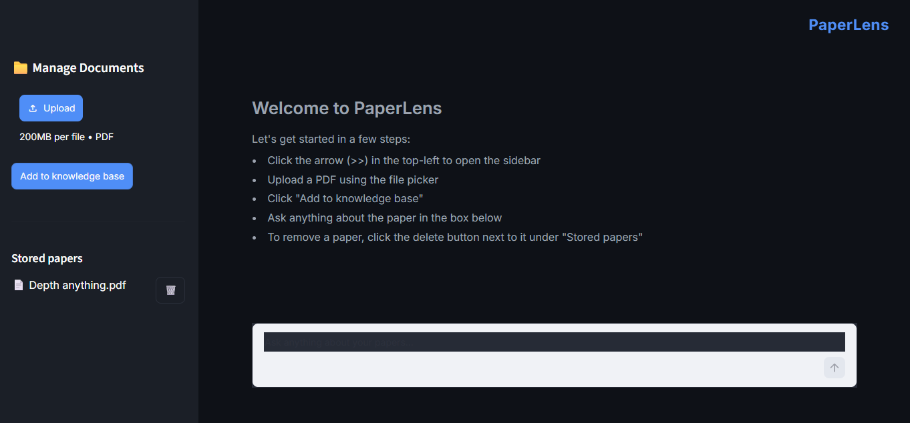
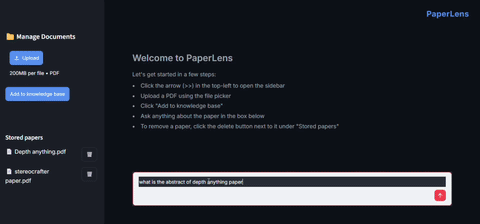
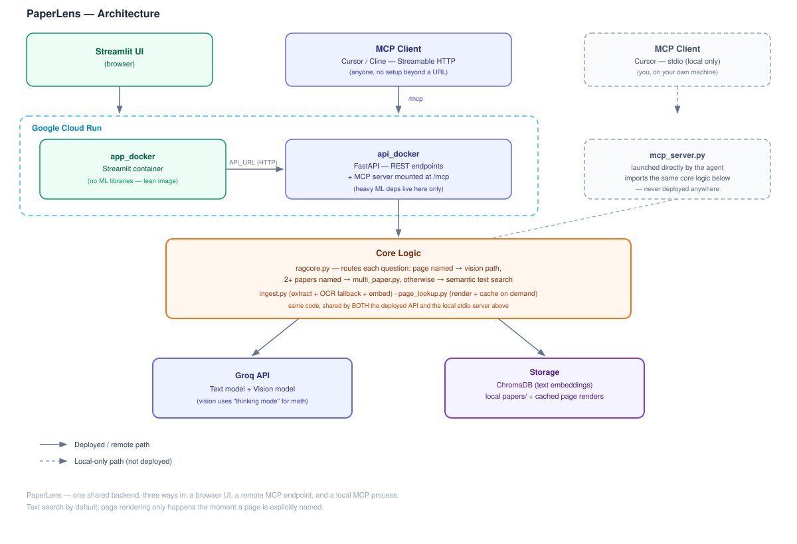

# PaperLens

**A multimodal Research Paper Companion.** Upload your papers, ask questions in plain language, and get answers grounded in what's actually in them — including the parts most "chat with your PDF" tools quietly ignore: figures, tables, and equations. Deployed and usable by anyone, not just locally.

---

## Live Demo

- **App:** [App URL](https://paperlens-app-569790627400.us-central1.run.app/)
- **API docs:** [API URL](https://paperlens-api-569790627400.us-central1.run.app)/docs
- **MCP endpoint:** [MCP URL](https://paperlens-api-569790627400.us-central1.run.app)/mcp — add to any MCP client (Cursor, Cline, Claude Desktop) to query your papers directly from an AI coding agent

| |

|  |

---

## Why This Exists

Most tools that let you "chat with a PDF" only ever read the extracted text layer. That works for prose, but anything living in a diagram, chart, or equation gets silently dropped before the model ever sees it — ask about a figure, and you get an answer synthesized from its caption, not from the figure itself.

The project went through a real redesign to get this right. The first version tried to make every page semantically searchable by image, CLIP-embedding every rendered page alongside the text. It worked, but it was solving a problem that doesn't come up often — in practice, people reference figures by naming them directly ("explain the diagram on page 4"), not by vague visual similarity. So the project was rebuilt: plain text search handles general questions, and a page's image is only ever rendered — on demand, then cached — the moment a question actually references it.

---

## How It Works

**Two independent answer paths, one shared knowledge base:**

- **No page named** → the question is embedded and matched against stored text chunks, and Groq's text model answers from the closest matches.
- **A page is named explicitly** ("page 4," "the figure on page 12") → that page is rendered from the original PDF (or pulled from cache) and sent, image included, to a vision-capable Groq model — with its "thinking mode" specifically turned on for math and structural reasoning.
- **Two or more papers are named in one question** → runs a separate, source-filtered search per paper instead of one pooled search, so a comparison question can't accidentally end up drawing all its context from just one of the papers.

**Ingestion:** every PDF page's text is extracted and embedded locally (`sentence-transformers`, CPU-only) into ChromaDB. Pages with no extractable text layer (scanned documents) fall back to OCR (Tesseract) instead of being silently skipped. The original PDF is kept permanently — deliberately — so any page can still be rendered on demand, even long after upload.

**Interface:** a Streamlit front end talks to a FastAPI backend over HTTP — two genuinely separate processes/containers, the way a real product's frontend and backend are split.

**MCP:** the same backend logic is also exposed as an MCP (Model Context Protocol) server — reusable directly inside AI coding agents like Cursor or Cline, not just through the browser UI. Two implementations exist: a local **stdio** server (launched directly by the agent, no deployment needed, only usable on the machine it's running on) and a deployed **Streamable HTTP** server (mounted on the live backend at `/mcp`, reachable by anyone with the URL — this is the one a friend or recruiter could actually connect to without cloning anything).

---

## Architecture



---

## Tech Stack

| Layer | Tool |
|---|---|
| Embeddings | `sentence-transformers` (all-MiniLM-L6-v2) |
| Vector database | ChromaDB |
| Generation | Groq API (text + vision models) |
| OCR fallback | Tesseract |
| Backend | FastAPI |
| Frontend | Streamlit |
| MCP | `fastmcp` (stdio + Streamable HTTP) |
| PDF processing | PyMuPDF |
| Containerization | Docker, Docker Compose (two-service split) |
| Cloud | Google Cloud Run, Secret Manager |

---

## Installation (local)

Requires Python 3.10+. No GPU needed.

```bash
python -m venv venv
venv\Scripts\activate      # Windows
source venv/bin/activate   # Mac/Linux

pip install -r api_docker/requirements.txt
pip install -r app_docker/requirements.txt
```

Get a free Groq API key at https://console.groq.com/keys, and a free Hugging Face token at https://huggingface.co/settings/tokens (prevents an anonymous rate-limit error on repeated embedding-model downloads). Copy `.env.example` to `.env` and fill both in.

---

## Usage

**Local, two processes:**
```bash
uvicorn api_docker.api:app --reload
streamlit run app_docker/app.py
```

**Local, one command, via Docker Compose:**
```bash
docker compose up --build
```
Backend at `localhost:8000` (`/docs`, `/mcp`), frontend at `localhost:8501`.

**MCP, locally, via Cursor/Cline:** point your agent's MCP config at `mcp_server.py` (stdio) — see `.cursor/mcp.json.example` for the shape (fill in your own paths; the real file is git-ignored, see below).

**Cloud:** both services are deployed independently on Google Cloud Run, connected via an `API_URL` environment variable rather than a hardcoded address — see `docker-compose.yml` and the deploy notes in each service's folder for the exact commands.

---

## Project Structure

```
PaperLens/
├── docker-compose.yml
├── .env.example
├── .cursor/mcp.json.example
├── mcp_server.py                # stdio MCP server (local-only, agent-launched)
├── README.md
│
├── api_docker/
│   ├── Dockerfile
│   ├── requirements.txt
│   ├── api.py                    # FastAPI: REST endpoints + MCP mounted at /mcp
│   ├── ragcore.py                 # embeddings, ChromaDB, the two answer paths, Groq calls
│   ├── multi_paper.py               # multi-paper comparison, layered on top of ragcore.py
│   ├── ingest.py                     # saves PDFs permanently, extracts + OCRs + embeds text
│   └── page_lookup.py                 # on-demand page rendering + caching
│
├── app_docker/
│   ├── Dockerfile
│   ├── requirements.txt
│   └── app.py                    # Streamlit UI — sidebar + chat, dark mode
│
├── assets/
│   └── architecture_v3.svg
│
└── data/                        # papers/ and rendered_pages/ -- contents git-ignored
```

---

## A Few Things Worth Knowing About How This Was Built

This wasn't a straight line from idea to finished product, and that's worth being upfront about rather than presenting it as if it were. A real architectural pivot happened partway through — recognizing that semantic image search was solving a rare query pattern at real cost, and rebuilding around explicit page references instead. Along the way, a genuine list of production bugs turned up and got fixed one at a time: a page-lookup path that silently never fired because a function was missing its `return`; an inverted file-existence check; a `base64` encode/decode mix-up; a Docker `CMD` pointing at an absolute path instead of a relative one; a Cloud Run deploy silently landing in the wrong GCP project for a stretch of time because a default was never explicitly verified. None of these were caught by assumption — each one was traced by isolating the smallest possible reproduction and getting direct evidence before touching a fix. That process is honestly a bigger part of what this project demonstrates than any single feature is.

---

## Limitations

- Text extraction relies on the PDF's built-in text layer, with OCR as a fallback for scanned pages — OCR itself only recovers *text*, not diagram or table *structure*.
- Page-lookup requires an explicit page number *and* an identifiable paper; with multiple papers stored and neither named, it asks for clarification rather than guessing.
- Figure/table *numbers* aren't mapped to pages automatically — "explain Figure 3" only reliably works if a page number is also mentioned.
- Retrieval is dense/semantic, which is weak at exact proper-noun or keyword lookup (a name mentioned once may not surface even when it's genuinely present) — a known trade-off of this architecture, not a bug.
- Questions requiring synthesis across an entire document ("how many equations are in this paper," "list every heading") aren't well served by top-k retrieval, which only ever sees a handful of the most relevant chunks.
- MCP's `ingest_paper` tool takes a local file path, not uploaded content — it can't ingest a file living on someone else's machine; adding papers happens through the Streamlit UI.
- Free-tier cloud hosting means the backend's data can reset after extended inactivity (Cloud Run scaling to zero) — expected behavior of the hosting tier, not a bug.

---

## Future Scope

- **Hybrid search** (semantic + BM25 keyword matching) to close the proper-noun/exact-term recall gap noted above.
- **Heading extraction** via font-size metadata, answering structural questions ("list all headings") without needing an LLM call at all.
- **YouTube video support** — not just transcript search (which existing tools already do), but keyframe extraction at slide/scene changes, so on-screen equations and diagrams during a talk are searchable too.
- **GitHub repository linking** — many papers link an official code implementation; searching that alongside the paper itself would close the gap between "what the paper says" and "how it's actually implemented."
- **MCP file ingestion** — accepting file content directly (not just a local path), so a remote MCP client could genuinely add a paper, not just query existing ones.

---

## License

MIT
